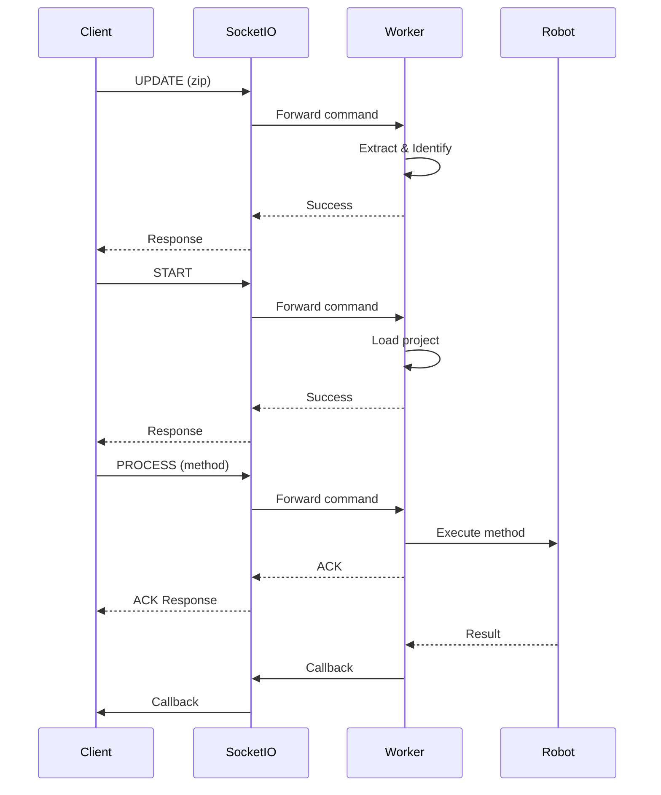

# 机器人控制系统 - 后端服务

基于 Socket.IO + ZeroMQ 的机器人远程控制后端服务，支持 Python 项目的动态加载和执行。

## ✨ 特性

- 🔧 **双进程架构** - Socket.IO Server + Worker 进程，职责分离
- 🔌 **Socket.IO 通信** - 实时双向通信，自动重连，心跳检测
- ⚡️ **IPC 通信** - 使用 ZeroMQ Unix Domain Socket 实现进程间通信
- 🔐 **单客户端限制** - 同一时刻只允许一个客户端连接，避免冲突
- 🐍 **Python 项目支持** - 动态导入模块，实时函数调用
- 🔄 **自动重启** - UPDATE 后自动重启 Worker 清理模块缓存
- 🧹 **智能线程清理** - WebSocket 断开时自动停止用户线程，保留缓存快速重连
- 📦 **项目管理** - ZIP 包上传、解压、类型识别

## 📋 系统要求

- Python 3.8+
- ZeroMQ
- 操作系统：Linux/macOS/Windows

## 📦 安装

### 安装依赖

```bash
pip install -r requirements.txt -i https://mirrors.aliyun.com/pypi/simple/
```

依赖包说明：
- **fastapi** - Web 框架
- **uvicorn** - ASGI 服务器
- **python-socketio** - Socket.IO 服务端实现
- **pyzmq** - ZeroMQ Python 绑定
- **pyyaml** - 配置文件解析

## 🚀 启动

### 本地运行

```bash
python main.py
```

启动后你将看到：

```
============================================================
机器人远程控制系统
Robot Control System
============================================================
Starting Worker process...
✓ Worker process started (PID: 12345)
Starting WebSocket Server process...
All processes started successfully

============================================================
✓ Socket.IO Server: http://0.0.0.0:8000
✓ Worker Process: Running
============================================================

[INFO] Worker will auto-restart on UPDATE command
Press Ctrl+C to stop...
```

### Docker 运行

```bash
# 构建镜像
docker build -t robot-control-backend .

# 运行容器
docker run -d -p 8000:8000 \
  --name robot-backend \
  robot-control-backend

# 查看日志
docker logs -f robot-backend
```

## 📁 项目结构

```
backend/
├── main.py                     # 主启动脚本
├── config.yaml                 # 系统配置文件
├── requirements.txt            # Python 依赖
├── Dockerfile                  # Docker 配置
├── ws_server/                  # Socket.IO 服务模块
│   ├── server.py              # Socket.IO 服务器主程序
│   ├── connection_manager.py  # 单客户端连接管理
│   └── protocol.py            # 协议定义和验证
├── worker/                     # Worker 执行模块
│   ├── worker.py              # Worker 主进程
│   ├── project_manager.py     # 项目管理（解压、识别）
│   └── python_executor.py     # Python 项目执行器
├── ipc/                        # 进程间通信模块
│   ├── zmq_manager.py         # ZeroMQ 管理器
│   └── messages.py            # 消息格式定义
├── storage/                    # 运行时存储目录
│   ├── projects/              # 项目文件
│   │   ├── default/           # 默认项目（系统预置）
│   │   └── current/           # 当前运行的项目
│   └── logs/                  # 日志文件
└── tests/                      # 测试文件
    ├── test_client.py         # Socket.IO 客户端测试
    └── create_test_project.py # 创建测试项目
```

## ⚙️ 配置说明

### config.yaml

```yaml
websocket:
  host: "0.0.0.0"              # Socket.IO 监听地址
  port: 8000                    # Socket.IO 监听端口
  max_message_size: 104857600   # 最大消息大小（100MB）

worker:
  storage_dir: "./storage/projects"  # 项目存储目录
  max_execution_time: 300            # 最大执行时间（秒）
  
ipc:
  command_socket: "ipc:///tmp/robot-control-cmd.ipc"      # 命令通道
  callback_socket: "ipc:///tmp/robot-control-callback.ipc"  # 回调通道
```

## 🔌 通信协议

### Socket.IO 事件

#### 客户端 → 服务器

**UPDATE - 上传项目**
```javascript
socket.emit('update', {
  data: "base64_encoded_zip_data"
}, (response) => {
  // {status: 'success', message: '...', data: {...}}
})
```

**START - 启动项目**
```javascript
socket.emit('start', {}, (response) => {
  // {status: 'success', message: 'Project started', data: {...}}
})
```

**PROCESS - 执行指令**
```javascript
socket.emit('process', {
  params: {
    object: "sport_client",
    method: "StandUp",
    args: {}
  }
}, (response) => {
  // 立即返回 ACK
})
```

#### 服务器 → 客户端

**同步响应** - 通过 emit callback 返回
```javascript
socket.emit('process', data, (response) => {
  // 立即获得同步响应
  // {status: 'success', message: '...', data: {...}}
})
```

**异步推送** - 通过自定义事件（仅用于实时数据流）
```javascript
// 监听实时识别结果（由用户代码主动推送）
socket.on('recognition_result', (data) => {
  // {count: 1, object: '球', confidence: 0.95, ...}
})
```

**CALLBACK 事件** - 保留用于未来扩展
```javascript
socket.on('callback', (data) => {
  // 当前不使用，避免与同步响应重复
})
```

### IPC 消息格式

**Command (REQ-REP)**
```json
{
  "command": "update|start|process",
  "data": {...},
  "params": {...}
}
```

**Callback (PUB-SUB)**
```json
{
  "type": "callback",
  "data": {...}
}
```

## 🐍 Python 项目规范

### 项目结构

```
my_robot_project/
├── main.py              # 必需：主模块
└── requirements.txt     # 可选：依赖
```

### 同步操作示例（推荐用于快速操作）

```python
# main.py

class RobotController:
    def __init__(self):
        print("RobotController initialized")
    
    def prepare_mode(self):
        """准备模式 - 快速同步操作"""
        # 立即完成的操作
        self.mode = "prepare"
        return {
            "status": "success", 
            "message": "准备模式已激活",
            "mode": self.mode
        }
    
    def get_status(self):
        """获取状态 - 同步查询"""
        return {
            "status": "success",
            "mode": self.mode,
            "battery": 85
        }

# 创建全局实例（必需）
robot_controller = RobotController()
```

### 耗时操作处理（根据时长选择）

**1-3 秒操作：直接同步执行**
```python
def medium_task(self):
    """1-3秒的操作，直接执行即可"""
    time.sleep(2)  # 模拟耗时操作
    return {"status": "success", "result": "完成"}
```
前端会等待 2 秒后收到响应，用户体验可接受。

**5 秒以上：后台线程 + push_message**
```python
import threading

# push_message 由系统注入
push_message = None

class RobotController:
    def start_long_task(self):
        """启动耗时任务，立即返回"""
        threading.Thread(target=self._do_work, daemon=True).start()
        return {"status": "success", "message": "任务已启动"}
    
    def _do_work(self):
        """后台执行"""
        try:
            time.sleep(10)  # 耗时操作
            # 推送结果
            if push_message:
                push_message('task_completed', {"result": "完成"})
        except Exception as e:
            if push_message:
                push_message('task_error', {"message": str(e)})
```

前端监听结果：
```javascript
socket.on('task_completed', (data) => {
  console.log('任务完成:', data.result)
})
```

### 选择指南

| 耗时 | 处理方式 | 说明 |
|------|---------|------|
| < 1 秒 | 直接同步返回 | 最简单 |
| 1-3 秒 | 直接同步返回 | 可接受的等待时间 ⭐ |
| 5+ 秒 | 后台线程 + push_message | 避免阻塞，实时推送结果 |
| 持续任务 | 后台线程 + push_message | 如实时识别、监控 |

### 打包上传

```bash
cd my_robot_project
zip -r my_robot_project.zip .
```

## 🧹 WebSocket 断开时的线程清理

当 WebSocket 客户端断开连接时，系统会自动停止用户代码中运行的后台线程，但**保留已加载的模块和上下文**，使得重连后可以立即使用。

### 约定接口

用户代码实现 `stop()` 方法即可，支持两种方式：

**方式1: 对象级 `stop()` 方法**（推荐）

```python
# main.py

class RobotController:
    def start_recognition(self):
        """启动后台识别任务"""
        self.recognition_running = True
        self.thread = threading.Thread(target=self._worker, daemon=True)
        self.thread.start()
    
    def stop(self):
        """WebSocket 断开时自动调用"""
        if self.recognition_running:
            self.stop_recognition()
    
    def stop_recognition(self):
        """停止识别任务"""
        self.recognition_running = False
        if self.thread:
            self.thread.join(timeout=2)

robot_controller = RobotController()
```

**方式2: 模块级 `stop()` 函数**

```python
# main.py

class RobotController:
    # ... 同上 ...

robot_controller = RobotController()

def stop():
    """WebSocket 断开时自动调用"""
    if robot_controller.recognition_running:
        robot_controller.stop_recognition()
```

框架会自动调用：
1. Context 中对象的 `stop()` 方法
2. 或模块级的 `stop()` 函数

### 优势

| 特性 | 线程清理模式 | 完全重启模式 |
|------|------------|------------|
| 重连速度 | ~0.1s ⚡️ | ~1s |
| 状态保留 | ✓ | ✗ |
| 后台线程 | 自动停止 ✓ | 自动停止 ✓ |

## 🚀 默认项目功能

### 概述

系统支持**默认项目**功能，无需执行 UPDATE 和 START 指令即可直接使用 PROCESS。

### 工作原理

1. **Worker 启动时**：
   - 检查 `storage/projects/current/` 目录
   - 如果为空，自动从 `storage/projects/default/` 复制默认项目
   - 自动加载项目到内存

2. **首次 PROCESS 调用时**：
   - 如果项目未加载，尝试加载 `current/` 目录的项目
   - 如果 `current/` 为空，从 `default/` 复制后加载

3. **UPDATE 上传后**：
   - 覆盖 `current/` 目录（不影响 `default/`）
   - Worker 自动重启并加载新项目

### 使用方法

#### 方式一：使用系统默认项目

系统已内置默认项目，直接启动即可：

```bash
# 启动服务
python main.py

# 直接执行 PROCESS（无需 UPDATE/START）
```

#### 方式二：自定义默认项目

修改默认项目以适应你的需求：

```bash
# 编辑默认项目
vim storage/projects/default/main.py

# 重启 Worker 生效
pkill -f "python.*main.py"
python main.py
```

#### 方式三：上传新项目

使用 UPDATE 指令上传项目会覆盖 current 目录：

```javascript
// UPDATE 会覆盖 current/，但不影响 default/
socket.emit('update', {
  zip_data: base64_zip_data
})
```

### 目录说明

```
storage/projects/
├── default/          # 默认项目（系统预置，不会被 UPDATE 覆盖）
│   ├── main.py      # 默认的 Python 控制代码
│   └── README.md    # 说明文档
└── current/          # 当前运行的项目（UPDATE 会覆盖）
    └── main.py      # 实际运行的代码
```

### 恢复默认项目

如果需要恢复到系统默认项目：

```bash
# 方法1: 删除 current 目录并重启
rm -rf storage/projects/current/*
python main.py

# 方法2: 手动复制
cp -r storage/projects/default/* storage/projects/current/
python main.py
```

### 示例：直接使用 PROCESS

```javascript
// 无需 UPDATE/START，直接执行
socket.emit('process', {
  params: {
    object: "sport_client",
    method: "StandUp",
    args: {}
  }
}, (response) => {
  console.log(response)
  // 首次调用会自动加载默认项目
})
```

## 🔧 开发指南

### 添加新的执行器

1. 在 `worker/` 目录创建新的执行器文件
2. 继承基础执行器类
3. 实现 `load()` 和 `execute()` 方法
4. 在 `worker.py` 中注册新执行器

### 调试模式

```bash
# 启用详细日志
export LOG_LEVEL=DEBUG
python main.py
```

### 运行测试

```bash
# 创建测试项目
python tests/create_test_project.py

# 运行客户端测试
python tests/test_client.py
```

## 📊 监控和日志

### 日志位置

- **应用日志**: `storage/logs/app.log`
- **进程输出**: 控制台 stdout

### 查看日志

```bash
# 实时查看日志
tail -f storage/logs/app.log

# 查看 Worker 输出
# 输出会显示在启动终端
```

## 🔒 安全建议

1. **生产环境**
   - 修改 `config.yaml` 中的 `host` 为内网地址
   - 添加认证机制
   - 限制上传文件大小

2. **依赖隔离**
   - 使用虚拟环境运行
   - 用户项目依赖可能与系统冲突

3. **资源限制**
   - 设置合理的 `max_execution_time`
   - 监控进程内存和CPU使用

## ❓ 常见问题

### Q: Worker 进程崩溃？

**A:** 检查日志文件，常见原因：
- 用户项目代码错误
- 依赖缺失
- 内存不足

### Q: Socket.IO 连接失败？

**A:** 检查：
- 端口 8000 是否被占用
- 防火墙设置
- 配置文件是否正确

### Q: UPDATE 后项目未生效？

**A:** 系统会自动重启 Worker，等待几秒钟。检查：
- ZIP 文件格式是否正确
- 项目结构是否符合规范
- 日志中的错误信息

### Q: Python 模块无法卸载？

**A:** Python 无法完全卸载已导入模块，系统通过重启 Worker 解决此问题。

### Q: 如何停止服务？

**A:** 按 `Ctrl+C`，系统会优雅地关闭所有进程。

## 🔄 工作流程




## 📚 相关文档

- [架构设计文档](../docs/ARCHITECTURE.md) - 详细的系统架构说明
- [快速启动指南](../docs/QUICKSTART.md) - 快速开始使用
- [Socket.IO 快速指南](../docs/SOCKETIO_QUICKSTART.md) - Socket.IO 使用详解
- [前端客户端文档](../frontend/README.md) - Web 客户端使用指南

## 📝 许可证

查看 [LICENSE](../LICENSE) 文件了解详情。

